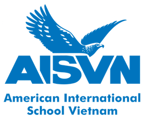

**AISVN** stands for American International School Vietnam. I started to work at this school on August 1st, 2017 and left the school 3 years later on July 31st, 2020.

During this time I worked as teacher for IB Physics HL and SL, Chemistry (all classes of grade 10), general Physics and Integrated Science (Biology, Chemistry and Physics for grade 9 and 10).

During these 3 years I also organized several ASA - After School Activities
- https://kreier.github.io/asa/
- https://kreier.github.io/asa2/
- https://kreier.github.io/asa3/
- 